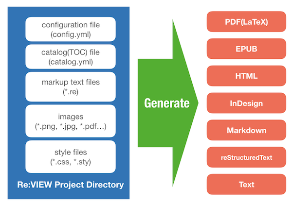

# Re:VIEW

[](http://badge.fury.io/rb/review)
[](https://github.com/kmuto/review/actions)
[](https://ci.appveyor.com/project/kmuto/review)

Re:VIEW is an easy-to-use digital publishing system for paper books and ebooks.

## Supported Formats



Output formats Re:VIEW supports are:

* EPUB
* LaTeX
* InDesign (IDGXML)
* Markdown
* plain text (TOPBuilder Text Markup Language)

Re:VIEW uses its original format('Re:VIEW format') as source files.  See doc/format.md.

## Commands

There are commands generate files directly.

* review-epubmaker: generate EPUB file.
* review-pdfmaker: generate PDF file using LaTeX (TeXLive).
* review-textmaker: generate text files.
* review-webmaker: generate Web pages.
* review-idgxmlmaker: generate InDesign XML files.

And some useful commands.

* review-init: create a project.
* review-compile: compile Re:VIEW format files.
* review-vol: figure out size of Re:VIEW files.
* review-index: generate index with various format.
* review-preproc: preprocessor.
* review-epub2html: generate single HTML file from EPUB for CSS typesetting.
* review-update: update project files.

## Installation

Install gem yourself as:

    $ gem install review

Or build from source:

    $ git clone https://github.com/kmuto/review.git
    $ cd review
    $ rake install

Or add the `./bin` directory to your $PATH:

$ echo "export PATH=PATH_OF_REVIEW/bin:$PATH" >> ~/.profile

## Quick Start

```
$ review-init hello
$ cd hello
$ (... add and edit *.re file, config.yml and catalog.yml ...)
$ rake epub         ## generating EPUB
$ rake pdf          ## generating PDF (Requirement TeXLive)
$ rake text         ## generating texts
$ rake web          ## generating Web pages
$ rake idgxml       ## generating InDesign XML files
$ rake vivliostyle  ## generating PDF using Vivliostyle-CLI (Requirement Vivliostyle-CLI)
```

For further information, see [doc/quickstart.md](https://github.com/kmuto/review/blob/master/doc/quickstart.md)

## Resources

|         | URL                                         |
|---------|---------------------------------------------|
| Home    | http://reviewml.org                         |
| Project | https://github.com/kmuto/review/            |
| Gems    | https://rubygems.org/gems/review            |
| Q&A     | https://github.com/kmuto/review/discussions |
| Wiki    | https://github.com/kmuto/review/wiki        |
| Bugs    | https://github.com/kmuto/review/issues      |

### Documents

* Wiki pages: https://github.com/kmuto/review/wiki
* doc/* files (in English and Japanese)

### Issues tracker

* GitHub: https://github.com/kmuto/review

### Note on Patches/Pull Requests

* Fork the project.
* Make your feature addition or bug fix.
* Add tests for it. This is important so I don't break it in a
  future version unintentionally.
* Commit, do not mess with rakefile, version, or history.
  (if you want to have your own version, that is fine but bump version in a commit by itself I can ignore when I pull)
* Send me a pull request. Bonus points for topic branches.

## License

Main part of Re:VIEW is applied GNU Lesser General Public License (LGPL).
See [COPYING](https://github.com/kmuto/review/blob/master/COPYING) file.

Exception:

* doc/*, samples/*: MIT License. See [LICENSE](https://github.com/kmuto/review/blob/master/doc/LICENSE) file.
* jumoline.sty, vendor/jumoline: The LaTeX Project Public License. See [LPPL](https://github.com/kmuto/review/blob/master/vendor/jumoline/lppl.txt) file.
* plistings.sty, vendor/plistings: MIT License. See [LICENSE](https://github.com/kmuto/review/blob/master/vendor/plistings/LICENSE) file.
* gentombow.sty, vendor/gentombow: BSD License. See [LICENSE](https://github.com/kmuto/review/blob/master/vendor/gentombow/LICENSE) file.
* jsbook.cls, vendor/jsclasses: BSD License. See [LICENSE](https://github.com/kmuto/review/blob/master/vendor/jsclasses/LICENSE) file.

## Copyright

Copyright (c) 2006-2022 Minero Aoki, Kenshi Muto, Masayoshi Takahashi, Masanori Kado.
