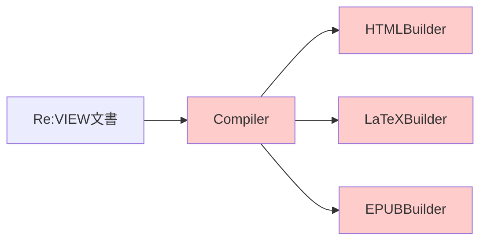
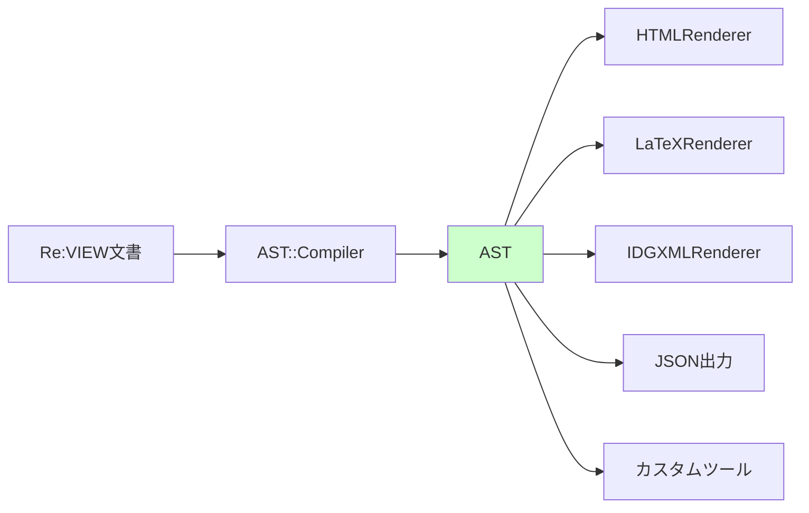
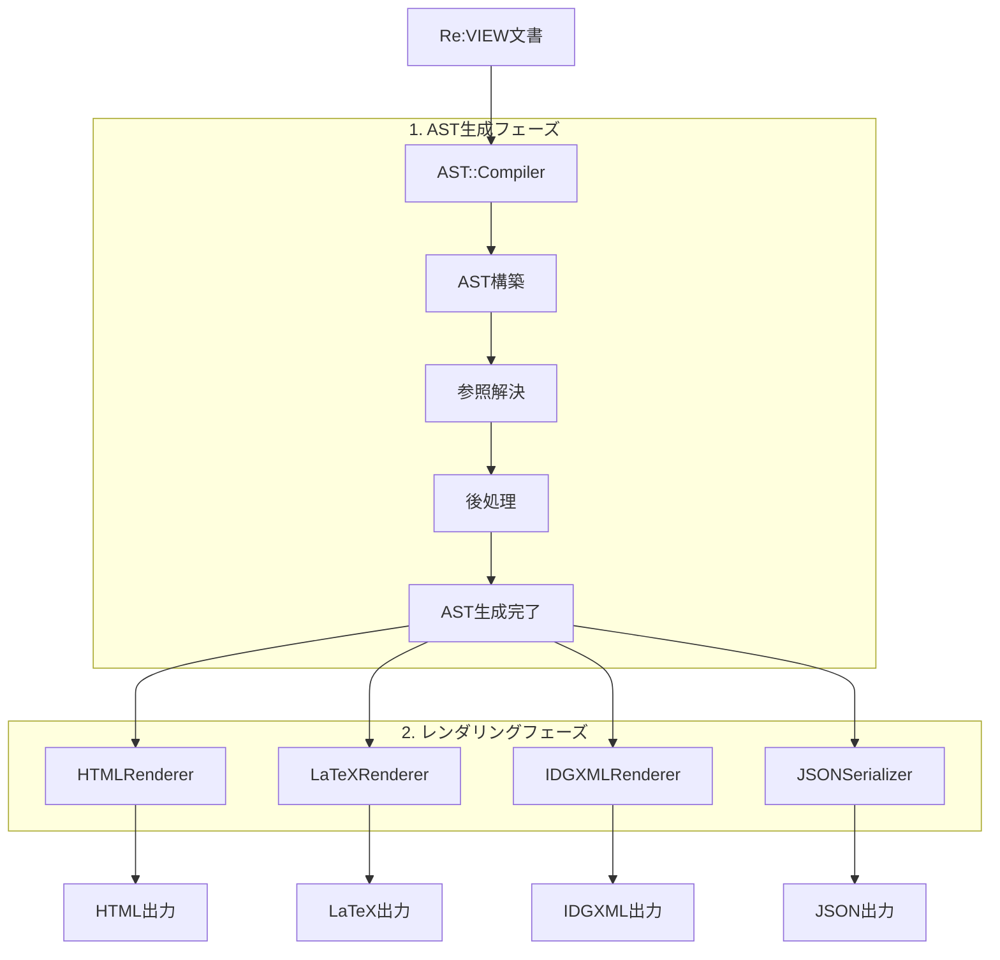
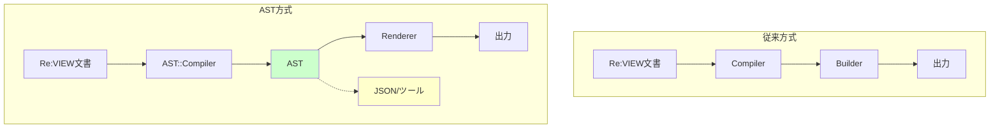
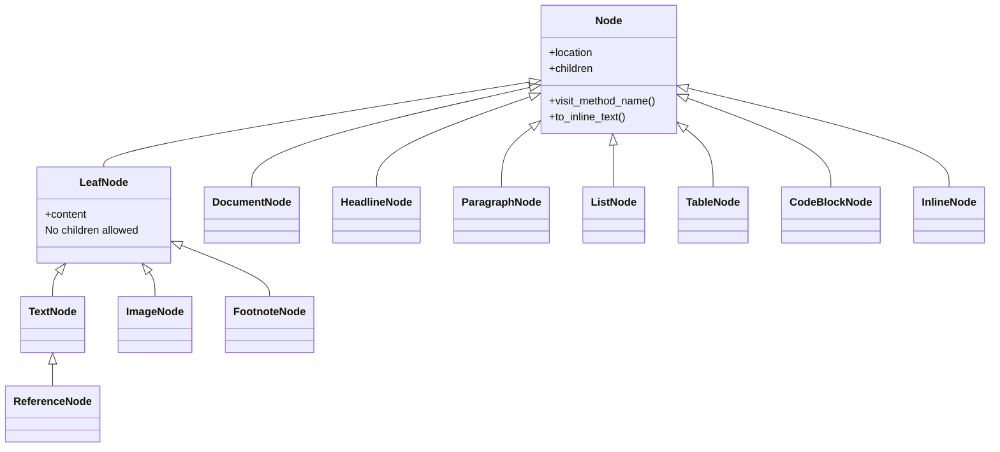

# Re:VIEW AST/Renderer 概要

このドキュメントは、Re:VIEWのAST（Abstract Syntax Tree：抽象構文木）/Rendererアーキテクチャの全体像を理解するための入門ガイドです。

## 目次

- [AST/Rendererとは](#astrendererとは)
- [なぜASTが必要なのか](#なぜastが必要なのか)
- [アーキテクチャ概要](#アーキテクチャ概要)
- [主要コンポーネント](#主要コンポーネント)
- [基本的な使い方](#基本的な使い方)
- [AST/Rendererでできること](#astrendererでできること)
- [より詳しく知るには](#より詳しく知るには)
- [FAQ](#faq)

## AST/Rendererとは

Re:VIEWのAST/Rendererは、Re:VIEW文書を構造化されたデータ（AST）して扱い、様々な出力フォーマットに変換するための新しいアーキテクチャです。

「AST（Abstract Syntax Tree：抽象構文木）」とは、文書の構造を木構造のデータとして表現したものです。例えば、見出し・段落・リスト・表といった要素が、親子関係を持つノードとして表現されます。

従来の直接Builder呼び出し方式と異なり、AST方式では文書構造を中間表現（AST）として明示的に保持することで、より柔軟で拡張性の高い文書処理を実現します。

## なぜASTが必要なのか

### 従来方式の課題



従来の方式では：
- フォーマット固有の処理が分散: 各Builderが独自に文書を解釈
- 構文解析と出力生成が密結合: 解析処理とフォーマット変換が分離されていない
- カスタム処理や拡張が困難: 新しいフォーマットや機能の追加が複雑
- 構造の再利用が不可: 一度解析した構造を他の用途で利用できない

### AST方式の利点



AST方式では：
- 構造の明示化: 文書構造を明確なデータモデル（ノードツリー）で表現
- 再利用性: 一度構築したASTを複数のフォーマットや用途で利用可能
- 拡張性: カスタムレンダラーやツールの開発が容易
- 解析・変換: JSON出力、双方向変換、構文解析ツールの実現
- 保守性: 構文解析とレンダリングの責務が明確に分離

## アーキテクチャ概要

### 処理フロー

Re:VIEW文書がAST経由で出力されるまでの流れ：



### 主要コンポーネントの役割

| コンポーネント | 役割 | 場所 |
|--------------|------|------|
| AST::Compiler | Re:VIEW文書を解析し、AST構造を構築 | `lib/review/ast/compiler.rb` |
| ASTノード | 文書の各要素（見出し、段落、リストなど）を表現 | `lib/review/ast/*_node.rb` |
| Renderer | ASTを各種出力フォーマットに変換 | `lib/review/renderer/*.rb` |
| Visitor | ASTを走査する基底クラス | `lib/review/ast/visitor.rb` |
| Indexer | 図表・リスト等のインデックスを構築 | `lib/review/ast/indexer.rb` |
| TextFormatter | テキスト整形とI18nを一元管理 | `lib/review/renderer/text_formatter.rb` |
| JSONSerializer | ASTとJSONの相互変換 | `lib/review/ast/json_serializer.rb` |

### 従来方式との比較



#### 主な違い
- 中間表現の有無: AST方式では明示的な中間表現（AST）を持つ
- 処理の分離: 構文解析とレンダリングが完全に分離
- 拡張性: ASTを利用したツールやカスタム処理が可能

## 主要コンポーネント

### AST::Compiler

Re:VIEW文書を読み込み、AST構造を構築するコンパイラです。

#### 主な機能
- Re:VIEW記法の解析（見出し、段落、ブロックコマンド、リスト等）
- Markdown入力のサポート（拡張子による自動切り替え）
- 位置情報の保持（エラー報告用）
- 参照解決と後処理の実行

#### 処理の流れ
1. 入力ファイルを1行ずつ走査
2. 各要素を適切なASTノードに変換
3. 参照解決（図表・リスト等への参照を解決）
4. 後処理（構造の正規化、番号付与等）

### ASTノード

文書の構造を表現する各種ノードクラスです。すべてのノードは`AST::Node`（ブランチノード）または`AST::LeafNode`（リーフノード）を継承します。

#### ノードの階層構造



#### 主要なノードクラス
- `DocumentNode`: 文書全体のルート
- `HeadlineNode`: 見出し（レベル、ラベル、キャプション）
- `ParagraphNode`: 段落
- `ListNode`/`ListItemNode`: リスト（箇条書き、番号付き、定義リスト）
- `TableNode`: 表
- `CodeBlockNode`: コードブロック
- `InlineNode`: インライン要素（太字、コード、リンク等）
- `TextNode`: プレーンテキスト（LeafNode）
- `ImageNode`: 画像（LeafNode）

詳細は[ast_node.md](./ast_node.md)を参照してください。

### Renderer

ASTを各種出力フォーマットに変換するクラスです。`Renderer::Base`を継承し、Visitorパターンでノードを走査します。

#### 主要なRenderer
- `HtmlRenderer`: HTML出力
- `LatexRenderer`: LaTeX出力
- `IdgxmlRenderer`: InDesign XML出力
- `MarkdownRenderer`: Markdown出力
- `PlaintextRenderer`: プレーンテキスト出力
- `TopRenderer`: TOP形式出力

#### Rendererの仕組み

```ruby
# 各ノードタイプに対応したvisitメソッドを実装
def visit_headline(node)
  # HeadlineNodeをHTMLに変換
  level = node.level
  caption = render_children(node.caption_node)
  "<h#{level}>#{caption}</h#{level}>"
end
```

詳細は[ast_architecture.md](./ast_architecture.md)を参照してください。

### 補助機能

#### JSONSerializer

ASTとJSON形式の相互変換を提供します。

```ruby
# AST → JSON
json = JSONSerializer.serialize(ast, options)

# JSON → AST
ast = JSONSerializer.deserialize(json)
```

##### 用途
- AST構造のデバッグ
- 外部ツールとの連携
- ASTの保存と復元

#### ReVIEWGenerator

ASTからRe:VIEW記法のテキストを再生成します。

```ruby
generator = ReVIEW::AST::ReviewGenerator.new
review_text = generator.generate(ast)
```

##### 用途
- 双方向変換（Re:VIEW ↔ AST ↔ Re:VIEW）
- 構造の正規化
- フォーマット変換ツールの実装

#### TextFormatter

Rendererで使用される、テキスト整形とI18n（国際化）を一元管理するサービスクラスです。

```ruby
# Renderer内で使用
formatter = text_formatter
caption = formatter.format_caption('list', chapter_number, item_number, caption_text)
```

##### 主な機能
- I18nキーを使用したテキスト生成（図表番号、キャプション等）
- フォーマット固有の装飾（HTML: `図1.1:`, TOP/TEXT: `図1.1　`）
- 章番号の整形（`第1章`, `Appendix A`等）
- 参照テキストの生成

##### 用途
- Rendererでの一貫したテキスト生成
- 多言語対応（I18nキーを通じた翻訳）
- フォーマット固有の整形ルールの集約

## 基本的な使い方

### コマンドライン実行

Re:VIEW文書をAST経由で各種フォーマットに変換します。

#### 単一ファイルのコンパイル

```bash
# HTML出力
review-ast-compile --target=html chapter.re > chapter.html

# LaTeX出力
review-ast-compile --target=latex chapter.re > chapter.tex

# JSON出力（AST構造を確認）
review-ast-compile --target=json chapter.re > chapter.json

# AST構造のダンプ（デバッグ用）
review-ast-dump chapter.re
```

#### 書籍全体のビルド

AST Rendererを使用した書籍全体のビルドには、専用のmakerコマンドを使用します：

```bash
# PDF生成（LaTeX経由）
review-ast-pdfmaker config.yml

# EPUB生成
review-ast-epubmaker config.yml

# InDesign XML生成
review-ast-idgxmlmaker config.yml

# テキスト生成（TOP形式またはプレーンテキスト）
review-ast-textmaker config.yml          # TOP形式（◆→マーカー付き）
```

これらのコマンドは、従来の`review-pdfmaker`、`review-epubmaker`等と同じインターフェースを持ちますが、内部的にAST Rendererを使用します。

### プログラムからの利用

Ruby APIを使用してASTを操作できます。

```ruby
require 'review'
require 'review/ast/compiler'
require 'review/renderer/html_renderer'
require 'stringio'

# 設定を読み込む
config = ReVIEW::Configure.create(yamlfile: 'config.yml')
book = ReVIEW::Book::Base.new('.', config: config)

# チャプターを取得
chapter = book.chapters.first

# ASTを生成（参照解決を有効化）
compiler = ReVIEW::AST::Compiler.new
ast_root = compiler.compile_to_ast(chapter, reference_resolution: true)

# HTMLに変換
renderer = ReVIEW::Renderer::HtmlRenderer.new(chapter)
html = renderer.render(ast_root)

puts html
```

#### 異なるフォーマットへの変換

```ruby
# LaTeXに変換
require 'review/renderer/latex_renderer'
latex_renderer = ReVIEW::Renderer::LatexRenderer.new(chapter)
latex = latex_renderer.render(ast_root)

# Markdownに変換
require 'review/renderer/markdown_renderer'
md_renderer = ReVIEW::Renderer::MarkdownRenderer.new(chapter)
markdown = md_renderer.render(ast_root)

# TOP形式に変換
require 'review/renderer/top_renderer'
top_renderer = ReVIEW::Renderer::TopRenderer.new(chapter)
top_text = top_renderer.render(ast_root)
```

### よくあるユースケース

#### 1. カスタムレンダラーの作成

特定の用途向けに独自のレンダラーを実装できます。

```ruby
class MyCustomRenderer < ReVIEW::Renderer::Base
  def visit_headline(node)
    # 独自のヘッドライン処理
  end

  def visit_paragraph(node)
    # 独自の段落処理
  end
end
```

#### 2. AST解析ツールの作成

ASTを走査して統計情報を収集するツールを作成できます。

```ruby
class WordCountVisitor < ReVIEW::AST::Visitor
  attr_reader :word_count

  def initialize
    @word_count = 0
  end

  def visit_text(node)
    @word_count += node.content.split.size
  end
end

visitor = WordCountVisitor.new
visitor.visit(ast)
puts "Total words: #{visitor.word_count}"
```

#### 3. 文書構造の変換

ASTを操作して文書構造を変更できます。

```ruby
# 特定のノードを検索して置換
ast.children.each do |node|
  if node.is_a?(ReVIEW::AST::HeadlineNode) && node.level == 1
    # レベル1の見出しを処理
  end
end
```

## AST/Rendererでできること

### 対応フォーマット

AST/Rendererは以下の出力フォーマットに対応しています：

| フォーマット | Renderer | Makerコマンド | 用途 |
|------------|----------|--------------|------|
| HTML | `HtmlRenderer` | `review-ast-epubmaker` | Web公開、プレビュー、EPUB生成 |
| LaTeX | `LatexRenderer` | `review-ast-pdfmaker` | PDF生成（LaTeX経由） |
| IDGXML | `IdgxmlRenderer` | `review-ast-idgxmlmaker` | InDesign組版 |
| Markdown | `MarkdownRenderer` | `review-ast-compile` | Markdown形式への変換 |
| Plaintext | `PlaintextRenderer` | `review-ast-textmaker -n` | 装飾なしプレーンテキスト |
| TOP | `TopRenderer` | `review-ast-textmaker` | 編集マーカー付きテキスト |
| JSON | `JSONSerializer` | `review-ast-compile` | AST構造のJSON出力 |

### 拡張機能

AST/Rendererならではの機能：

#### JSON出力
```bash
# AST構造をJSON形式で出力
review-ast-compile --target=json chapter.re
```

##### 用途
- AST構造のデバッグ
- 外部ツールとの連携
- 構文解析エンジンとしての利用

#### 双方向変換
```bash
# Re:VIEW → AST → JSON → AST → Re:VIEW
review-ast-compile --target=json chapter.re > ast.json
# JSONからRe:VIEWテキストを再生成
review-ast-generate ast.json > regenerated.re
```

##### 用途
- 構造の正規化
- フォーマット変換
- 文書の検証

#### カスタムツール開発

ASTを利用して独自のツールを開発できます：

- 文書解析ツール: 文書の統計情報収集
- リンティングツール: スタイルチェック、構造検証
- 変換ツール: 独自フォーマットへの変換
- 自動化ツール: 文書生成、テンプレート処理

### Re:VIEW全要素への対応

AST/Rendererは、Re:VIEWのすべての記法要素に対応しています：

##### ブロック要素
- 見出し（`=`, `==`, `===`）
- 段落
- リスト（箇条書き、番号付き、定義リスト）
- 表（`//table`）
- コードブロック（`//list`, `//emlist`, `//cmd`等）
- 画像（`//image`, `//indepimage`）
- コラム（`//note`, `//memo`, `//column`等）
- 数式（`//texequation`）

##### インライン要素
- 装飾（`@<b>`, `@<i>`, `@<tt>`等）
- リンク（`@<href>`, `@<link>`）
- 参照（`@`, `@<table>`, `@<list>`, `@<hd>`等）
- 脚注（`@<fn>`）
- ルビ（`@<ruby>`）

詳細は[ast_node.md](./ast_node.md)および[ast_architecture.md](./ast_architecture.md)を参照してください。

## より詳しく知るには

AST/Rendererについてさらに詳しく知るには、以下のドキュメントを参照してください：

### 詳細ドキュメント

| ドキュメント | 内容 |
|------------|------|
| [ast_architecture.md](./ast_architecture.md) | アーキテクチャ全体の詳細説明。パイプライン、コンポーネント、処理フローの詳細 |
| [ast_node.md](./ast_node.md) | ASTノードクラスの完全なリファレンス。各ノードの属性、メソッド、使用例 |
| [ast_list_processing.md](./ast_list_processing.md) | リスト処理の詳細。ListParser、NestedListAssembler、後処理の仕組み |

### 推奨する学習順序

1. このドキュメント（ast.md）: まず全体像を把握
2. [ast_architecture.md](./ast_architecture.md): アーキテクチャの詳細を理解
3. [ast_node.md](./ast_node.md): 具体的なノードクラスを学習
4. [ast_list_processing.md](./ast_list_processing.md): 複雑なリスト処理を深掘り
5. ソースコード: 実装の詳細を確認

### サンプルコード

実際の使用例は以下を参照してください：

- `lib/review/ast/command/compile.rb`: コマンドライン実装
- `lib/review/renderer/`: 各種Rendererの実装
- `test/ast/`: ASTのテストコード（使用例として参考になります）

## FAQ

### Q1: 従来のBuilderとAST/Rendererの使い分けは？

A: 現時点では両方とも使用可能です。

- AST/Renderer方式: 新機能（JSON出力、双方向変換等）が必要な場合、カスタムツールを開発する場合
- 従来のBuilder方式: 既存のプロジェクトやワークフローを維持する場合

将来的にはAST/Renderer方式を標準とすることを目指しています。

### Q2: 既存のプロジェクトをAST方式に移行する必要はありますか？

A: 必須ではありません。従来の方式もしばらくは引き続きサポートされます。ただし、新しい機能や拡張を利用したい場合は、AST方式の使用を推奨します。

### Q3: カスタムRendererを作成するには？

A: `Renderer::Base`を継承し、必要な`visit_*`メソッドをオーバーライドします。

```ruby
class MyRenderer < ReVIEW::Renderer::Base
  def visit_headline(node)
    # 独自の処理
  end
end
```

詳細は[ast_architecture.md](./ast_architecture.md)のRenderer層の説明を参照してください。

### Q4: ASTのデバッグ方法は？

A: 以下の方法があります：

1. JSON出力でAST構造を確認:
   ```bash
   review-ast-compile --target=json chapter.re | jq .
   ```

2. review-ast-dumpコマンドを使用:
   ```bash
   review-ast-dump chapter.re
   ```

3. プログラムから直接確認:
   ```ruby
   require 'pp'
   pp ast.to_h
   ```

### Q5: パフォーマンスは従来方式と比べてどうですか？

A: AST方式は中間表現（AST）を構築するオーバーヘッドがありますが、以下の利点があります：

- 一度構築したASTを複数のフォーマットで再利用可能（複数フォーマット出力時に効率的）
- 構造化されたデータモデルによる最適化の余地
- 参照解決やインデックス構築の効率化

通常の使用では、パフォーマンスの差はほとんど体感できないレベルです。

### Q6: Markdownファイルも処理できますか？

A: はい、対応しています。ファイルの拡張子（`.md`）によって自動的にMarkdownコンパイラが使用されます。

```bash
review-ast-compile --target=html chapter.md
```

### Q7: 既存のプラグインやカスタマイズは動作しますか？

A: AST/Rendererは従来のBuilderシステムとは独立しています。従来のBuilderプラグインはそのまま動作しますが、AST/Renderer方式では新しいカスタマイズ方法（カスタムRenderer、Visitor等）を使用します。
