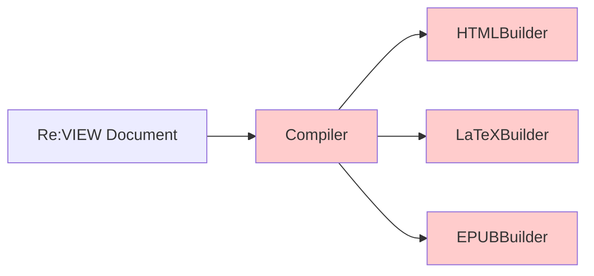
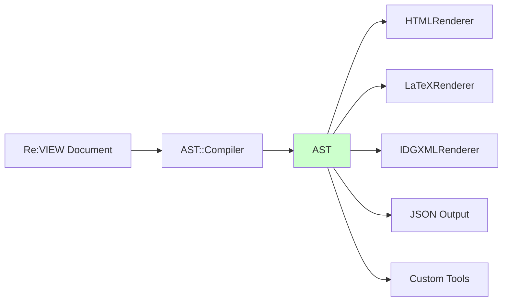
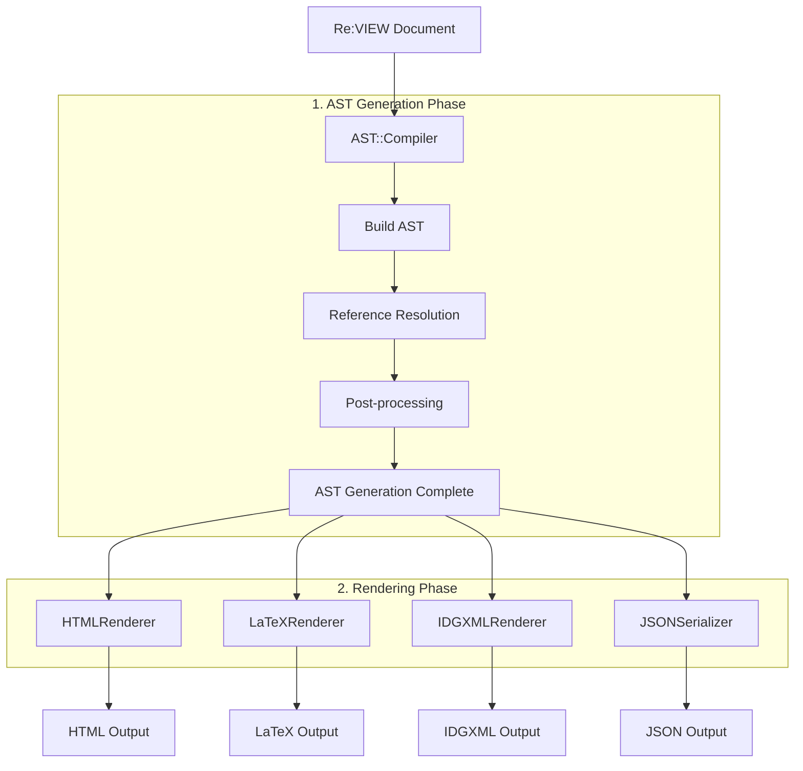
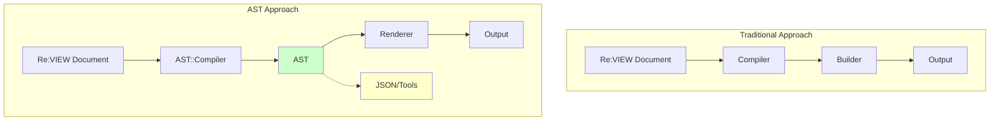
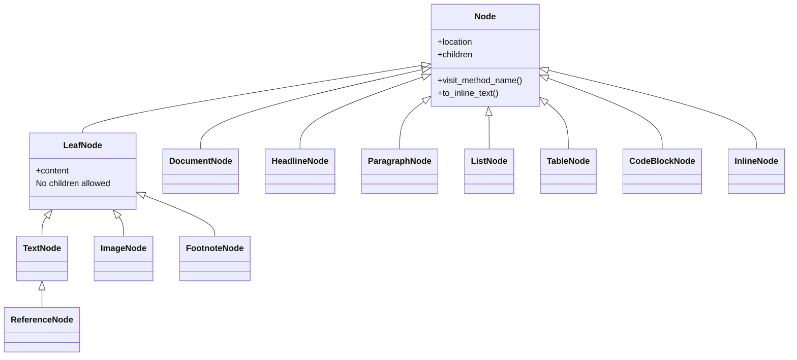

# Re:VIEW AST/Renderer Overview

This document is an introductory guide to understanding the overall architecture of Re:VIEW's AST (Abstract Syntax Tree)/Renderer.

## Table of Contents

- [What is AST/Renderer](#what-is-astrenderer)
- [Why AST is Needed](#why-ast-is-needed)
- [Architecture Overview](#architecture-overview)
- [Key Components](#key-components)
- [Basic Usage](#basic-usage)
- [What AST/Renderer Can Do](#what-astrenderer-can-do)
- [Learning More](#learning-more)
- [FAQ](#faq)

## What is AST/Renderer

Re:VIEW's AST/Renderer is a new architecture for handling Re:VIEW documents as structured data (AST) and converting them to various output formats.

An "AST (Abstract Syntax Tree)" is a representation of document structure as a tree-structured data model. For example, elements such as headings, paragraphs, lists, and tables are represented as nodes with parent-child relationships.

Unlike the traditional direct Builder invocation approach, the AST approach explicitly maintains document structure as an intermediate representation (AST), enabling more flexible and extensible document processing.

## Why AST is Needed

### Challenges with the Traditional Approach



In the traditional approach:
- Format-specific processing is scattered: Each Builder interprets documents independently
- Parsing and output generation are tightly coupled: Parsing logic and format conversion are not separated
- Custom processing and extensions are difficult: Adding new formats or features is complex
- Structure reuse is not possible: Once-parsed structure cannot be reused for other purposes

### Benefits of the AST Approach



The AST approach provides:
- Explicit structure: Document structure is represented with a clear data model (node tree)
- Reusability: Once-built AST can be used for multiple formats and purposes
- Extensibility: Easy to develop custom renderers and tools
- Analysis & transformation: Enables JSON output, bidirectional conversion, and syntax analysis tools
- Maintainability: Clear separation of concerns between parsing and rendering

## Architecture Overview

### Processing Flow

The flow from Re:VIEW document to output via AST:



### Roles of Key Components

| Component | Role | Location |
|-----------|------|----------|
| AST::Compiler | Parses Re:VIEW documents and builds AST structure | `lib/review/ast/compiler.rb` |
| AST Nodes | Represents document elements (headings, paragraphs, lists, etc.) | `lib/review/ast/*_node.rb` |
| Renderer | Converts AST to various output formats | `lib/review/renderer/*.rb` |
| Visitor | Base class for traversing AST | `lib/review/ast/visitor.rb` |
| Indexer | Builds indexes for figures, tables, listings, etc. | `lib/review/ast/indexer.rb` |
| TextFormatter | Centrally manages text formatting and I18n | `lib/review/renderer/text_formatter.rb` |
| JSONSerializer | Bidirectional conversion between AST and JSON | `lib/review/ast/json_serializer.rb` |

### Comparison with Traditional Approach



#### Key Differences
- Intermediate representation: AST approach has explicit intermediate representation (AST)
- Separation of concerns: Parsing and rendering are completely separated
- Extensibility: Tools and custom processing using AST are possible

## Key Components

### AST::Compiler

A compiler that reads Re:VIEW documents and builds AST structure.

#### Main Features
- Parsing Re:VIEW syntax (headings, paragraphs, block commands, lists, etc.)
- Support for Markdown input (automatic switching based on file extension)
- Maintains location information (for error reporting)
- Reference resolution and post-processing execution

#### Processing Flow
1. Scan input file line by line
2. Convert each element to appropriate AST nodes
3. Reference resolution (resolve references to figures, tables, listings, etc.)
4. Post-processing (structure normalization, numbering, etc.)

### AST Nodes

Various node classes that represent document structure. All nodes inherit from either `AST::Node` (branch node) or `AST::LeafNode` (leaf node).

#### Node Hierarchy



#### Major Node Classes
- `DocumentNode`: Root of the entire document
- `HeadlineNode`: Headings (level, label, caption)
- `ParagraphNode`: Paragraphs
- `ListNode`/`ListItemNode`: Lists (bulleted, numbered, definition lists)
- `TableNode`: Tables
- `CodeBlockNode`: Code blocks
- `InlineNode`: Inline elements (bold, code, links, etc.)
- `TextNode`: Plain text (LeafNode)
- `ImageNode`: Images (LeafNode)

See [ast_node.md](./ast_node.md) for details.

### Renderer

Classes that convert AST to various output formats. They inherit from `Renderer::Base` and traverse nodes using the Visitor pattern.

#### Major Renderers
- `HtmlRenderer`: HTML output
- `LatexRenderer`: LaTeX output
- `IdgxmlRenderer`: InDesign XML output
- `MarkdownRenderer`: Markdown output
- `PlaintextRenderer`: Plain text output
- `TopRenderer`: TOP format output

#### How Renderers Work

```ruby
# Implement visit methods corresponding to each node type
def visit_headline(node)
  # Convert HeadlineNode to HTML
  level = node.level
  caption = render_children(node.caption_node)
  "<h#{level}>#{caption}</h#{level}>"
end
```

See [ast_architecture.md](./ast_architecture.md) for details.

### Supporting Features

#### JSONSerializer

Provides bidirectional conversion between AST and JSON format.

```ruby
# AST → JSON
json = JSONSerializer.serialize(ast, options)

# JSON → AST
ast = JSONSerializer.deserialize(json)
```

##### Use Cases
- Debugging AST structure
- Integration with external tools
- Saving and restoring AST

#### ReVIEWGenerator

Regenerates Re:VIEW syntax text from AST.

```ruby
generator = ReVIEW::AST::ReviewGenerator.new
review_text = generator.generate(ast)
```

##### Use Cases
- Bidirectional conversion (Re:VIEW ↔ AST ↔ Re:VIEW)
- Structure normalization
- Implementing format conversion tools

#### TextFormatter

A service class used by Renderers that centrally manages text formatting and I18n (internationalization).

```ruby
# Used within Renderers
formatter = text_formatter
caption = formatter.format_caption('list', chapter_number, item_number, caption_text)
```

##### Main Features
- Text generation using I18n keys (figure numbers, captions, etc.)
- Format-specific decoration (HTML: `Figure 1.1:`, TOP/TEXT: `Figure 1.1　`)
- Chapter number formatting (`Chapter 1`, `Appendix A`, etc.)
- Reference text generation

##### Use Cases
- Consistent text generation in Renderers
- Multilingual support (translation through I18n keys)
- Centralization of format-specific formatting rules

## Basic Usage

### Command-Line Execution

Convert Re:VIEW documents to various formats via AST.

#### Compiling a Single File

```bash
# HTML output
review-ast-compile --target=html chapter.re > chapter.html

# LaTeX output
review-ast-compile --target=latex chapter.re > chapter.tex

# JSON output (check AST structure)
review-ast-compile --target=json chapter.re > chapter.json

# Dump AST structure (for debugging)
review-ast-dump chapter.re
```

#### Building Entire Books

To build entire books using AST Renderer, use dedicated maker commands:

```bash
# PDF generation (via LaTeX)
review-ast-pdfmaker config.yml

# EPUB generation
review-ast-epubmaker config.yml

# InDesign XML generation
review-ast-idgxmlmaker config.yml

# Text generation (TOP format or plain text)
review-ast-textmaker config.yml          # TOP format (with ◆→ markers)
```

These commands have the same interface as traditional `review-pdfmaker`, `review-epubmaker`, etc., but internally use AST Renderer.

### Using from Programs

You can manipulate AST using the Ruby API.

```ruby
require 'review'
require 'review/ast/compiler'
require 'review/renderer/html_renderer'
require 'stringio'

# Load configuration
config = ReVIEW::Configure.create(yamlfile: 'config.yml')
book = ReVIEW::Book::Base.new('.', config: config)

# Get chapter
chapter = book.chapters.first

# Generate AST (with reference resolution enabled)
compiler = ReVIEW::AST::Compiler.new
ast_root = compiler.compile_to_ast(chapter, reference_resolution: true)

# Convert to HTML
renderer = ReVIEW::Renderer::HtmlRenderer.new(chapter)
html = renderer.render(ast_root)

puts html
```

#### Converting to Different Formats

```ruby
# Convert to LaTeX
require 'review/renderer/latex_renderer'
latex_renderer = ReVIEW::Renderer::LatexRenderer.new(chapter)
latex = latex_renderer.render(ast_root)

# Convert to Markdown
require 'review/renderer/markdown_renderer'
md_renderer = ReVIEW::Renderer::MarkdownRenderer.new(chapter)
markdown = md_renderer.render(ast_root)

# Convert to TOP format
require 'review/renderer/top_renderer'
top_renderer = ReVIEW::Renderer::TopRenderer.new(chapter)
top_text = top_renderer.render(ast_root)
```

### Common Use Cases

#### 1. Creating Custom Renderers

You can implement your own renderer for specific purposes.

```ruby
class MyCustomRenderer < ReVIEW::Renderer::Base
  def visit_headline(node)
    # Custom headline processing
  end

  def visit_paragraph(node)
    # Custom paragraph processing
  end
end
```

#### 2. Creating AST Analysis Tools

You can create tools that traverse AST to collect statistics.

```ruby
class WordCountVisitor < ReVIEW::AST::Visitor
  attr_reader :word_count

  def initialize
    @word_count = 0
  end

  def visit_text(node)
    @word_count += node.content.split.size
  end
end

visitor = WordCountVisitor.new
visitor.visit(ast)
puts "Total words: #{visitor.word_count}"
```

#### 3. Document Structure Transformation

You can manipulate AST to modify document structure.

```ruby
# Search and replace specific nodes
ast.children.each do |node|
  if node.is_a?(ReVIEW::AST::HeadlineNode) && node.level == 1
    # Process level 1 headings
  end
end
```

## What AST/Renderer Can Do

### Supported Formats

AST/Renderer supports the following output formats:

| Format | Renderer | Maker Command | Purpose |
|--------|----------|---------------|---------|
| HTML | `HtmlRenderer` | `review-ast-epubmaker` | Web publishing, preview, EPUB generation |
| LaTeX | `LatexRenderer` | `review-ast-pdfmaker` | PDF generation (via LaTeX) |
| IDGXML | `IdgxmlRenderer` | `review-ast-idgxmlmaker` | InDesign typesetting |
| Markdown | `MarkdownRenderer` | `review-ast-compile` | Conversion to Markdown format |
| Plaintext | `PlaintextRenderer` | `review-ast-textmaker -n` | Plain text without decoration |
| TOP | `TopRenderer` | `review-ast-textmaker` | Text with editorial markers |
| JSON | `JSONSerializer` | `review-ast-compile` | JSON output of AST structure |

### Extended Features

Features unique to AST/Renderer:

#### JSON Output
```bash
# Output AST structure in JSON format
review-ast-compile --target=json chapter.re
```

##### Use Cases
- Debugging AST structure
- Integration with external tools
- Use as a parsing engine

#### Bidirectional Conversion
```bash
# Re:VIEW → AST → JSON → AST → Re:VIEW
review-ast-compile --target=json chapter.re > ast.json
# Regenerate Re:VIEW text from JSON
review-ast-generate ast.json > regenerated.re
```

##### Use Cases
- Structure normalization
- Format conversion
- Document validation

#### Custom Tool Development

You can develop your own tools using AST:

- Document analysis tools: Collecting document statistics
- Linting tools: Style checking, structure validation
- Conversion tools: Converting to custom formats
- Automation tools: Document generation, template processing

### Support for All Re:VIEW Elements

AST/Renderer supports all Re:VIEW syntax elements:

##### Block Elements
- Headings (`=`, `==`, `===`)
- Paragraphs
- Lists (bulleted, numbered, definition lists)
- Tables (`//table`)
- Code blocks (`//list`, `//emlist`, `//cmd`, etc.)
- Images (`//image`, `//indepimage`)
- Columns (`//note`, `//memo`, `//column`, etc.)
- Math equations (`//texequation`)

##### Inline Elements
- Decoration (`@<b>`, `@<i>`, `@<tt>`, etc.)
- Links (`@<href>`, `@<link>`)
- References (`@`, `@<table>`, `@<list>`, `@<hd>`, etc.)
- Footnotes (`@<fn>`)
- Ruby (`@<ruby>`)

See [ast_node.md](./ast_node.md) and [ast_architecture.md](./ast_architecture.md) for details.

## Learning More

To learn more about AST/Renderer, refer to the following documents:

### Detailed Documentation

| Document | Content |
|----------|---------|
| [ast_architecture.md](./ast_architecture.md) | Detailed explanation of the overall architecture. Pipeline, components, and processing flow details |
| [ast_node.md](./ast_node.md) | Complete reference for AST node classes. Attributes, methods, and usage examples for each node |
| [ast_list_processing.md](./ast_list_processing.md) | Details of list processing. ListParser, NestedListAssembler, and post-processing mechanisms |

### Recommended Learning Path

1. This document (ast.md): First, grasp the overall picture
2. [ast_architecture.md](./ast_architecture.md): Understand architectural details
3. [ast_node.md](./ast_node.md): Learn specific node classes
4. [ast_list_processing.md](./ast_list_processing.md): Deep dive into complex list processing
5. Source code: Check implementation details

### Sample Code

See the following for actual usage examples:

- `lib/review/ast/command/compile.rb`: Command-line implementation
- `lib/review/renderer/`: Implementation of various Renderers
- `test/ast/`: AST test code (useful as usage examples)

## FAQ

### Q1: How to choose between traditional Builder and AST/Renderer?

A: Both are currently available.

- AST/Renderer approach: When you need new features (JSON output, bidirectional conversion, etc.) or want to develop custom tools
- Traditional Builder approach: When maintaining existing projects or workflows

We aim to make the AST/Renderer approach the standard in the future.

### Q2: Do I need to migrate existing projects to AST approach?

A: It's not mandatory. The traditional approach will continue to be supported for a while. However, if you want to use new features and extensions, we recommend using the AST approach.

### Q3: How to create a custom Renderer?

A: Inherit from `Renderer::Base` and override the necessary `visit_*` methods.

```ruby
class MyRenderer < ReVIEW::Renderer::Base
  def visit_headline(node)
    # Custom processing
  end
end
```

See the Renderer layer explanation in [ast_architecture.md](./ast_architecture.md) for details.

### Q4: How to debug AST?

A: There are several methods:

1. Check AST structure with JSON output:
   ```bash
   review-ast-compile --target=json chapter.re | jq .
   ```

2. Use review-ast-dump command:
   ```bash
   review-ast-dump chapter.re
   ```

3. Check directly from program:
   ```ruby
   require 'pp'
   pp ast.to_h
   ```

### Q5: How does performance compare to the traditional approach?

A: The AST approach has overhead from building the intermediate representation (AST), but offers the following benefits:

- Once-built AST can be reused for multiple formats (efficient when outputting multiple formats)
- Room for optimization through structured data model
- Efficient reference resolution and index building

In normal usage, the performance difference is hardly noticeable.

### Q6: Can Markdown files be processed?

A: Yes, they are supported. The Markdown compiler is automatically used based on the file extension (`.md`).

```bash
review-ast-compile --target=html chapter.md
```

### Q7: Do existing plugins and customizations work?

A: AST/Renderer is independent of the traditional Builder system. Traditional Builder plugins continue to work as is, but the AST/Renderer approach uses new customization methods (custom Renderers, Visitors, etc.).
